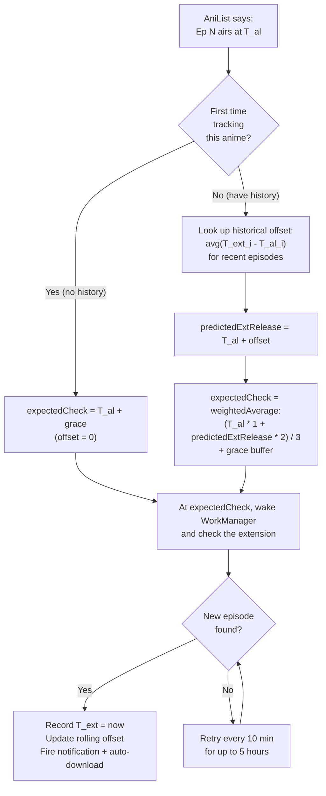

# Smart Episode Release Tracking — Implementation Plan

> The plan for the notification + auto-download system.
> **Status: APPROVED — implementation in progress on `feature/notifications`.**
> Last updated: 2026-07-16 (revised after user feedback).

---

## ⚡ Revisions after user feedback (2026-07-16)

The following changes were made to the original plan based on user feedback:

| # | Change | Section |
|---|--------|---------|
| 1 | **Retry timing changed**: retry every **10 min** for up to **5 hours** (was 5 min / 1 hour). System-level config, NOT user-facing. | §2.2 |
| 2 | **Extension release-time tracking** (NEW): the system remembers when episodes actually appear on the extension. Uses a **weighted average** (AniList weight 1, extension weight 2) to predict the next check time. | §2.5 (new) |
| 3 | **Manual refresh feeds the tracker**: when the user manually refreshes the episode list on the detail page and a new episode is found, that timestamp is recorded. | §2.5 |
| 4 | **Dub release-time tracking** (NEW): dub gets its own release-time tracking (sometimes different from sub). | §2.5 |
| 5 | **Three notify modes** (was two): (1) AniList-based, (2) Extension-confirmed, (3) Both. Mode 3 sends separate sub/dub notifications (extension only, since AniList doesn't distinguish). | §2.4 |
| 6 | **Three-dot menu** replaces bell icon: a three-dot button at the top of the detail page opens a dropdown menu (notification settings, download settings, etc.). | §4.2 |
| 7 | **Auto-download sub/dub dependency**: if `autoDownloadNew` is OFF, the sub/dub toggles below it are **disabled** (cannot be turned on). | §4.1 |
| 8 | **Finished anime with pending dubs**: completed anime ARE still tracked if they have ≥1 dub episode AND remaining dub episodes. | §6.3 |
| 9 | **Non-library tracking prompt**: if user tries to track an anime not in their library, prompt them to add it first. | §6.2 |
| 10 | **Remove from library = remove tracking**: automatic cleanup. | §6.2 |
| 11 | **Grace buffer dynamically adjusted**: after the system learns the extension's release-time offset, the grace buffer adapts. | §2.2 |
| 12 | **Background battery permission**: requested on app startup (onboarding) so the app can run in the background. | §13 (risks) |
| 13 | **Supabase integration deferred**: door kept open (crowd-sourced release tracking + dedup). NOT implemented now. | §2.5 |
| 14 | **Airing time on detail page**: show the next episode's airing time on the anime detail page. | §11.2 |
| 15 | **All 7 phases without user testing**: the user can't easily test due to anime release schedules. Implement all phases, verify via GitHub Actions, test later. | §12 |
| 16 | **ntfy notification after each phase**: send to `ntfy.sh/TASKISDONE`. | §12 |

---

## 0. What we're building (one paragraph)

A background system that **smartly detects when new episodes of tracked anime
are released**, notifies the user, and (optionally) auto-downloads them. It is
**not** a dumb periodic poll — it uses **AniList's airing schedule** to know
*when* an episode should drop, waits ~10 minutes after that time, then checks
the extension to see if the episode is actually available. It supports **sub
and dub** detection (by resolving videos for the new episode), per-anime
notification + auto-download toggles, and a separate **watch-flow auto-download**
(while watching ep N, pre-download N+1).

---

## 1. The four subsystems

This feature has **4 independent but cooperating pieces**. Each gets its own
folder for modularity.

```
app/anikuta/
├── notification/      ← [1] Smart release tracking + notifications
├── download/          ← [2] New-release auto-download (extends existing)
├── player/            ← [3] Watch-flow auto-download (extends existing)
└── data/cache/        ← [4] Release-tracking state store (extends existing)
```

| # | Subsystem | Folder | Purpose |
|---|-----------|--------|---------|
| 1️⃣ | **Release tracker + notifier** | `app/anikuta/notification/` | The brain. Knows when to check, checks the extension, fires notifications. |
| 2️⃣ | **New-release auto-download** | extends `app/anikuta/download/` | When the tracker finds a new episode AND the user opted in, triggers a download. Communicates with the tracker via a clear interface. |
| 3️⃣ | **Watch-flow auto-download** | extends `app/anikuta/player/` | While watching ep N (downloaded), pre-downloads N+1. Separate feature, later. |
| 4️⃣ | **Tracking state store** | extends `app/anikuta/data/cache/` | Persists: which anime are tracked, last-known episode count, last-check time, last-seen airing time. The tracker's memory. |

**User's explicit requirement:** subsystems 1 and 2 are **separate** — they
communicate via an interface, not by being one tangled system. This keeps them
modular and independently testable.

---

## 2. How the smart timing works (the core innovation)

Most apps poll every N hours. We do better — we **know when to look**.

### 2.1 The timing flow

```
 ┌─────────────────────────────────────────────────────────────────┐
 │  ANILIST AIRING SCHEDULE (source of truth for "when")           │
 │  nextAiringEpisode { airingAt, episode, timeUntilAiring }       │
 │  (already fetched today — stored in Anime.nextEpisodeAiringAt)  │
 └─────────────────────────────────────────────────────────────────┘
                              │
                              ▼
 ┌─────────────────────────────────────────────────────────────────┐
 │  STEP 1: SCHEDULER picks the next check time                     │
 │                                                                  │
 │   nextCheckTime = airingAt + 10 minutes (grace buffer)           │
 │                                                                  │
 │   Why 10 min? Extensions often lag a few minutes behind the      │
 │   official airing. Waiting avoids false "not available yet".     │
 └─────────────────────────────────────────────────────────────────┘
                              │
                              ▼
 ┌─────────────────────────────────────────────────────────────────┐
 │  STEP 2: At nextCheckTime, WorkManager wakes the tracker         │
 │                                                                  │
 │   Tracker fetches the extension's episode list for that anime    │
 │   Tracker compares to last-known episode list (from store 4️⃣)    │
 └─────────────────────────────────────────────────────────────────┘
                              │
                 ┌────────────┴────────────┐
                 ▼                         ▼
      ┌──────────────────┐      ┌──────────────────┐
      │ NEW episode found│      │ Not yet available│
      │  (episode count  │      │ (extension still │
      │   went up OR a   │      │  shows old count)│
      │   new number)    │      └──────────────────┘
      └──────────────────┘              │
                │                       ▼
                │          ┌────────────────────────┐
                │          │ Retry every 10 minutes │
                │          │ for up to 5 hours,     │
                │          │ then give up until     │
                │          │ next airing event      │
                │          └────────────────────────┘
                ▼
 ┌─────────────────────────────────────────────────────────────────┐
 │  STEP 3: NEW EPISODE CONFIRMED AVAILABLE                         │
 │                                                                  │
 │   → Update store 4️⃣ (new episode count, last-seen time)          │
 │   → Resolve videos for the new episode (to detect sub/dub)       │
 │   → Fire notification (if user opted in for this anime)          │
 │   → Trigger auto-download (if user opted in for this anime)      │
 └─────────────────────────────────────────────────────────────────┘
```

### 2.2 The timing values

| Value | Default | User-configurable? | Purpose |
|-------|---------|--------------------|---------|
| **Grace buffer** | 10 min after expected release | ❌ (system-level; **dynamically adjusted** — see §2.5) | Wait for extension to catch up. |
| **Retry interval** | 10 min | ❌ (system-level, NOT user-facing) | If not available at first check, retry until found or 5 hours pass. |
| **Max retry window** | 5 hours | ❌ (system-level, NOT user-facing) | Give up after 5 hours; the next airing event will re-trigger. |

> **Note:** The grace buffer, retry interval, and max retry window are all
> **system-level constants** defined in `ReleaseTracker.kt` as `companion object`
> values. They are NOT exposed to the user in settings. They can be changed by
> the developer later if needed. The grace buffer is **dynamically adjusted**
> per-anime once the system learns the extension's release-time offset (§2.5).

### 2.3 What if AniList has no airing schedule?

Some anime (completed, or AniList doesn't have the schedule) have no
`nextAiringEpisode`. For those:
- **Fallback:** check once every 24 hours (a normal daily poll).
- This is the only "dumb poll" path; everything with a schedule uses smart timing.

### 2.4 The three notify modes

The user can choose between **three** notification modes (global setting):

| Mode | Name | Behavior |
|------|------|----------|
| **1** | **AniList-based** | Notify at `airingAt + grace` — the moment AniList says the episode aired. Does NOT check the extension. Does NOT distinguish sub/dub (AniList doesn't provide that). Notification says "Episode X has aired." |
| **2** | **Extension-confirmed** (default) | Only notify when the episode is actually available on the extension. Resolves videos to detect sub/dub. Sends separate sub/dub notifications based on user's per-anime sub/dub toggles. |
| **3** | **Both** | Sends an AniList notification at airing time AND extension-confirmed notifications when available. The extension notifications distinguish sub/dub; the AniList one does not. |

**Default:** Mode 2 (Extension-confirmed) — most useful because you can actually
watch when notified.

### 2.5 Extension release-time tracking (the smart learning layer)

This is the key innovation that makes the timing truly smart. The system
**learns** when each extension actually releases episodes and uses that
knowledge to predict future release times.

#### How it works



#### The weighted average formula

```
expectedCheckTime = (anilistAiringAt × 1 + predictedExtensionRelease × 2) / 3 + graceBuffer
```

- **AniList weight = 1** (the official schedule)
- **Extension weight = 2** (the actual observed behavior — leaned toward)
- `predictedExtensionRelease = anilistAiringAt + rollingAverageOffset`
- `rollingAverageOffset = average(T_ext_i - T_al_i)` over the last 5 observed episodes

This means: if AniList says 9:00 PM but the extension consistently releases at
9:15 PM, the system learns the +15 min offset and starts checking at
`(9:00 × 1 + 9:15 × 2) / 3 = 9:10 PM` + grace buffer.

#### What feeds the offset learning

1. **Background tracker checks** — when the tracker detects a new episode, it records `T_ext = detectionTime`.
2. **Manual refresh** — when the user manually refreshes the episode list on the detail page and a new episode is found compared to the stored state, that timestamp is also recorded as `T_ext`.

#### Dub release-time tracking (separate)

Dub episodes sometimes release at a different time (often a week later). The
system tracks dub release times **separately** from sub:

- `subReleaseOffset` — rolling average for sub episodes
- `dubReleaseOffset` — rolling average for dub episodes

When checking for a new dub episode, the system uses `dubReleaseOffset` (if
available) instead of `subReleaseOffset`.

#### Supabase integration (deferred — door kept open)

The architecture is designed to later support a **Supabase-backed crowd-sourced
release tracker**:
- When a new episode is detected, it's reported to Supabase.
- Before checking the extension, the system first checks Supabase: "has anyone
  else reported this episode as released recently?"
- If yes (and it was checked <5 min ago), skip the extension check — saves
  battery + API calls.
- If no, proceed with the extension check and report the result.

**This is NOT implemented now.** The `ReleaseTrackingStore` interface is designed
to accommodate it later without restructuring. The `ReleaseTracker` has a clear
hook point where a Supabase check would be inserted.

---

## 3. Sub/Dub handling (the user is right — it's detectable)

I was wrong earlier. Sub/dub **is** detectable, but it requires **resolving
videos** for the episode (not just reading the episode list). The existing code
already does this:

- `DetailViewModel.resolveVideos()` → calls `source.fetchVideoList(episode)`
- `VideoTitleParser.parse(video)` → extracts `AudioVersion` (SUB/DUB/HSUB) from video titles
- Result cached in `SubDubStore` per anime

### 3.1 How the tracker uses this

When a new episode is detected as available:

```
New episode found on extension
        │
        ▼
Resolve videos for that ONE episode (not all — just the new one)
        │
        ▼
Parse video titles → detect AudioVersion set {SUB, DUB, HSUB, ...}
        │
        ├─ Has SUB? → if user wants sub notifications → notify "New SUB ep"
        ├─ Has DUB? → if user wants dub notifications → notify "New DUB ep"
        └─ Update SubDubStore with the new counts
```

### 3.2 The dub-lag handling

Dub episodes often release **behind** sub (e.g. sub ep 12 drops Tuesday, dub ep 12 drops the following week). The tracker handles this by:

- **Always checking the latest few episodes** (not just the newest) when it runs.
- If the extension's dub count for an older episode just appeared (wasn't there
  last check), that's a "new dub episode" event → notify dub-opted users.

Concretely: the tracker stores `lastKnownDubCount` per anime. If
`currentDubCount > lastKnownDubCount`, a new dub is out — even if it's for an
older episode number.

### 3.3 The cost (honest)

Resolving videos for one episode = one extra HTTP call to the extension per
check. For a tracker checking ~20 tracked anime per day at airing time, that's
~20 extra calls/day — negligible. We **only resolve videos when a new episode
is detected** (not on every check), so the cost stays low.

---

## 4. Per-anime settings (the user's explicit requirement)

Each anime gets its own notification + auto-download toggles. Stored per-anime
in a new `ReleaseTrackingStore` (SharedPreferences-backed, like the existing
`LibraryStore` / `WatchProgressStore`).

### 4.1 Per-anime settings

| Setting | Type | Default | Dependency |
|---------|------|---------|------------|
| `notifyOnNew` | Boolean | true (inherits global default) | — |
| `notifySub` | Boolean | true | Requires `notifyOnNew` = true |
| `notifyDub` | Boolean | true | Requires `notifyOnNew` = true |
| `autoDownloadNew` | Boolean | false | — |
| `autoDownloadSub` | Boolean | true | **Requires `autoDownloadNew` = true** (disabled if off) |
| `autoDownloadDub` | Boolean | false | **Requires `autoDownloadNew` = true** (disabled if off) |
| `autoDownloadQuality` | String? | null (use global default) | — |
| `autoDownloadAudio` | String? | null (use global default) | — |

> **Dependency rule:** if `autoDownloadNew` is OFF, the `autoDownloadSub` and
> `autoDownloadDub` toggles are **disabled** (greyed out, cannot be turned on).
> Same for `notifySub`/`notifyDub` when `notifyOnNew` is OFF.

### 4.2 Where the user edits these — three-dot menu

- **On the Detail page** — a **three-dot button** (⋮) at the very top of the
  header. Tapping it opens a **dropdown menu** with options:
  - "Notification settings" → opens `AnimeSettingsSheet` (per-anime toggles)
  - "Download settings" → opens download-specific per-anime settings
  - (future: more options can be added here easily)
- This approach avoids cluttering the screen with multiple buttons and gives
  flexibility to add more menu items later.
- A future enhancement may add a dedicated settings section for managing all
  tracked anime in one place, but for now the three-dot menu is the only entry
  point.

### 4.3 Global defaults (in Settings → Notifications)

| Setting | Type | Default |
|---------|------|---------|
| `globalNotifyEnabled` | Boolean | true |
| `globalNotifySub` | Boolean | true |
| `globalNotifyDub` | Boolean | true |
| `globalAutoDownloadEnabled` | Boolean | false |
| `globalAutoDownloadSub` | Boolean | true |
| `globalAutoDownloadDub` | Boolean | false |
| `globalAutoDownloadQuality` | String | "1080" (or best available) |
| `globalAutoDownloadAudio` | String | "SUB" |
| `notifyMode` | Enum | EXTENSION_CONFIRMED (Mode 2) — see §2.4 for the 3 modes |
| `checkCompletedAnime` | Boolean | false (don't check completed series — but see §6.3 for the dub exception) |
| `quietHoursStart` | Int? | null (e.g. 23 = don't notify 11pm-7am) |
| `quietHoursEnd` | Int? | null |

Per-anime settings override global defaults. If a per-anime setting is "inherit"
(represented as null for quality/audio), the global value is used.

---

## 5. Data model (what gets stored)

### 5.1 New: `ReleaseTrackingStore` (SharedPreferences, like `LibraryStore`)

Keyed by AniList ID. Holds:

```kotlin
data class TrackedAnime(
    val anilistId: Int,
    val title: String,
    val coverUrl: String?,
    // Tracking state
    val lastKnownEpisodeCount: Int,       // from extension
    val lastKnownSubCount: Int,           // from SubDubStore
    val lastKnownDubCount: Int,           // from SubDubStore
    val lastCheckTime: Long,              // epoch millis
    val lastSeenAiringAt: Long,           // last airingAt we processed
    val nextScheduledCheck: Long,         // epoch millis (airingAt + grace)
    val isCompleted: Boolean,             // skip if true + checkCompletedAnime=false
    // Per-anime settings (null = inherit global)
    val notifyOnNew: Boolean?,            // null = global default
    val notifySub: Boolean?,
    val notifyDub: Boolean?,
    val autoDownloadNew: Boolean?,
    val autoDownloadSub: Boolean?,
    val autoDownloadDub: Boolean?,
    val autoDownloadQuality: String?,
    val autoDownloadAudio: String?,
)
```

### 5.2 Existing stores we reuse (no changes)

- `SubDubStore` — already caches sub/dub counts per anime. Tracker reads + updates.
- `LibraryStore` — the set of saved anime. **Default tracking = library anime.** (See §6.1.)
- `WatchProgressStore` — watch history. Used by watch-flow auto-download (§8).
- `Anime.nextEpisodeAiringAt` — the AniList airing time, already in the domain model.

### 5.3 New notification channel

In `Notifications.kt`, add:
```kotlin
const val CHANNEL_NEW_EPISODES = "new_episodes"  // default importance
const val ID_NEW_EPISODE_BASE = -600              // offset by anilistId for uniqueness
```

---

## 6. Which anime get tracked?

### 6.1 Default: library anime only

An anime is "tracked" if it's in the user's Library (saved). This matches
aniyomi's behavior and is the simplest, most battery-friendly default.

**Why not "all viewed"?** If a user clicks around 50 anime out of curiosity,
we'd start tracking 50 anime — battery drain + notification spam. Library-only
is the user's explicit "I care about this" signal.

### 6.2 Library membership rules

- **Adding to library** → automatically starts tracking (with global defaults).
- **Removing from library** → automatically removes tracking (the `ReleaseTrackingStore` entry is deleted).
- **Non-library anime tracking attempt** → if the user tries to enable notifications for an anime NOT in their library, the app **prompts them to add it to their library first**. No tracking without library membership.

So: **tracked = in library AND not explicitly opted out (per-anime `notifyOnNew = false`).**

### 6.3 Completed anime — the dub exception

If `anime.status == COMPLETED` on AniList, the tracker normally skips them
(no new episodes expected). **BUT** there's an exception:

> A completed anime IS still tracked if:
> - It has **≥1 dub episode** already released (from `SubDubStore`), AND
> - There are **remaining dub episodes** not yet released
>   (i.e. `dubCount < totalEpisodes`).
>
> This handles the case where the sub is fully released but the dub is still
> being released weekly (common for simul-dub anime).

The user can always manually turn tracking on/off for any individual anime in
their library via the three-dot menu (§4.2).

---

## 7. The scheduler (WorkManager)

### 7.1 One-time work, scheduled dynamically

We do **not** use a fixed periodic worker. Instead:

```
On app start / on library change / after a check completes:
  → Look at all tracked anime
  → For each, compute nextScheduledCheck = airingAt + grace (or now + 24h if no schedule)
  → Find the EARLIEST nextScheduledCheck across all tracked anime
  → Schedule a ONE-TIME WorkManager job for that time
  → When that job fires, check that ONE anime (+ any others whose time has also come)
  → After the check, re-schedule the next one-time job
```

This is the most battery-efficient approach — WorkManager only wakes the app
when there's actually something to check.

### 7.2 Constraints

- `NetworkType.CONNECTED` — no point checking offline.
- `BatteryNotLow = true` — don't drain the battery.

### 7.3 Boot receiver

A `BOOT_COMPLETED` receiver re-schedules the next check after device restart
(WorkManager one-time jobs don't survive reboot).

### 7.4 Fallback daily sweep

A daily periodic worker (once every 24h) as a safety net — catches anything
the smart scheduler missed (e.g. AniList schedule changed, app was killed).

---

## 8. Watch-flow auto-download (separate feature, later)

### 8.1 The trigger

When `PlayerActivity` starts playing episode N:

```
1. Is episode N downloaded? (check DownloadStore)
   NO  → do nothing (user is streaming, not watching a download)
   YES → continue
2. Is episode N+1 already downloaded?
   YES → do nothing
   NO  → continue
3. Does the user have watch-flow auto-download enabled? (global setting)
   NO  → do nothing
   YES → continue
4. Does episode N+1 meet the user's sub/dub preference?
   (resolve videos for N+1, check AudioVersion against preference)
   NO  → do nothing
   YES → trigger download via DownloadManager with preferred quality/audio
5. Mark N+1 as "auto-downloading" so we don't trigger twice
```

### 8.2 Where it lives

A new `app/anikuta/player/WatchFlowAutoDownload.kt` — called from
`PlayerActivity` when playback starts. Small, focused, no UI.

### 8.3 Settings

Global only (no per-anime, per the user's instruction):
- `watchFlowAutoDownloadEnabled` (Boolean, default false)
- `watchFlowAutoDownloadAudio` (Enum: SUB/DUB/ANY, default SUB)
- `watchFlowAutoDownloadQuality` (String, default "1080")

### 8.4 Why it's separate

- Different trigger (playback start vs. background schedule).
- Different coupling (player vs. notification system).
- Easier to disable/remove independently.

---

## 9. The notification UI

### 9.1 What the notification looks like

```
┌─────────────────────────────────────────────┐
│ 🎬 ANI-KUTA                                  │
│ New episode available                        │
│ One Piece — Episode 1016                     │
│ "The Land of Wano — Final Act!"             │
│                                              │
│ [▶ Watch]  [⬇ Download]                     │
└─────────────────────────────────────────────┘
```

- **Tap** → opens the detail page (or player if already downloaded).
- **"Watch" action button** → opens player at that episode.
- **"Download" action button** → triggers a one-off download (only shown if not already auto-downloaded).

### 9.2 Grouping

If multiple new episodes drop at once (e.g. 3 anime all aired at the same
time), group them into a single summary notification:

```
┌─────────────────────────────────────────────┐
│ 🎬 ANI-KUTA — 3 new episodes                 │
│  • One Piece — Ep 1016                       │
│  • Jujutsu Kaisen — Ep 24                    │
│  • Demon Slayer — Ep 8 (DUB)                 │
└─────────────────────────────────────────────┘
```

Expand for details; tap any to open that anime.

### 9.3 Quiet hours

If `quietHoursStart`/`quietHoursEnd` are set and the current time is within
quiet hours, the notification is **delivered silently** (no sound/vibration)
but still shown. (We can't easily defer delivery without a separate worker;
silent delivery is the simple approach.)

---

## 10. The settings page (new)

A new top-level settings subpage: **Settings → Notifications** (replaces the
current empty placeholder).

### 10.1 Sections

```
SETTINGS → NOTIFICATIONS
├── General
│   ├── Enable notifications              [toggle]
│   ├── Notify mode                       [Extension-confirmed / AniList-based]
│   ├── Grace buffer                      [5/10/15/30 min]
│   └── Retry interval                    [5/10/15 min]
├── Sub/Dub
│   ├── Notify on new SUB                 [toggle]
│   ├── Notify on new DUB                 [toggle]
│   └── Check completed anime             [toggle]
├── Auto-download (new releases)
│   ├── Enable auto-download              [toggle]
│   ├── Auto-download SUB                 [toggle]
│   ├── Auto-download DUB                 [toggle]
│   ├── Preferred quality                 [1080/720/360/Best]
│   └── Preferred audio                   [SUB/DUB/ANY]
├── Quiet hours
│   ├── Enable quiet hours                [toggle]
│   ├── Start                             [time picker]
│   └── End                               [time picker]
└── Tracked anime
    └── [list of tracked anime with per-anime toggles + a "manage" link]
```

### 10.2 Where it's added

- New file: `app/anikuta/ui/settings/NotificationSettingsScreen.kt`
- New entry in `SettingsHomeScreen.kt` (the settings hub)
- New route in `AnikutaNavGraph.kt`: `settings/notifications`
- Per-anime settings UI: a `NotificationSettingsSheet.kt` shown from the detail page bell icon.

---

## 11. File-by-file change list (what gets created/modified)

### 11.1 NEW files (the notification subsystem)

```
app/anikuta/notification/
├── ReleaseTrackerWorker.kt          ← WorkManager worker (the scheduler entry point)
├── ReleaseTracker.kt                ← The brain: decides what to check, checks it, fires events
├── ReleaseCheckPlanner.kt           ← Computes nextScheduledCheck, schedules WorkManager jobs
├── NewEpisodeDetector.kt            ← Diffs extension episode list vs. stored state
├── SubDubResolver.kt                ← Resolves videos for one episode, returns AudioVersion set
├── NotificationDispatcher.kt        ← Builds + fires the Android notifications
├── BootReceiver.kt                  ← Re-schedules after device reboot
└── (DI registration in AppModule.kt)

app/anikuta/data/cache/
└── ReleaseTrackingStore.kt          ← SharedPreferences-backed per-anime tracking state

app/anikuta/ui/settings/
├── NotificationSettingsScreen.kt    ← The settings subpage
└── NotificationSettingsSheet.kt     ← Per-anime sheet (from detail page bell)
```

### 11.2 MODIFIED files (minimal touches)

```
app/anikuta/data/notification/Notifications.kt
  + CHANNEL_NEW_EPISODES, ID_NEW_EPISODE_BASE

app/anikuta/App.kt
  + register CHANNEL_NEW_EPISODES
  + schedule initial ReleaseTrackerWorker on first launch

app/anikuta/di/AppModule.kt
  + addSingleton(ReleaseTrackingStore)
  + addSingleton(ReleaseTracker)
  + addSingleton(ReleaseCheckPlanner)

app/anikuta/ui/detail/DetailScreen.kt
  + bell icon in header → opens NotificationSettingsSheet

app/anikuta/ui/settings/SettingsHomeScreen.kt
  + "Notifications" row → settings/notifications

app/anikuta/navigation/AnikutaNavGraph.kt
  + settings/notifications route

app/anikuta/AndroidManifest.xml
  + RECEIVE_BOOT_COMPLETED permission
  + BootReceiver <receiver> entry

gradle/libs.versions.toml  (no new deps — WorkManager already in)
```

### 11.3 Watch-flow auto-download (separate, later) — NEW files

```
app/anikuta/player/
└── WatchFlowAutoDownload.kt         ← Called from PlayerActivity on playback start
```

MODIFIED:
```
app/anikuta/player/PlayerActivity.kt
  + call WatchFlowAutoDownload.maybeDownloadNext(currentEpisode) in onPlayStart
```

---

## 12. Implementation phases (the order I'll build in)

Each phase is a verifiable milestone. I'll commit after each, you test, we move on.

### Phase N-1: Foundation (no UI, no notifications yet)
- `ReleaseTrackingStore` (the data layer)
- DI registration
- `ReleaseCheckPlanner` (computes next check time, schedules WorkManager)
- `BootReceiver`
- **Verify:** app builds; on install, the store is empty; nothing crashes.

### Phase N-2: Detection (the brain, no notifications yet)
- `ReleaseTracker` + `ReleaseTrackerWorker`
- `NewEpisodeDetector` (diff logic)
- `SubDubResolver`
- Run the worker manually (via debug screen) on one tracked anime
- **Verify:** logs show "new episode detected" when I add a fake anime with a known airing time. No notifications yet.

### Phase N-3: Notifications (the user-visible part)
- `NotificationDispatcher`
- New notification channel
- The notification UI (with action buttons)
- Grouping for multiple
- **Verify:** trigger a fake new-episode event → notification appears → tap → opens detail.

### Phase N-4: Settings UI
- `NotificationSettingsScreen`
- `NotificationSettingsSheet` (per-anime, from detail page bell)
- Global + per-anime settings wired to the tracker
- **Verify:** toggle a setting → tracker behavior changes.

### Phase N-5: Auto-download hook (new releases)
- Interface between `ReleaseTracker` and `DownloadManager`
- When a new episode is detected AND auto-download opted in → trigger download with preferred quality/audio
- **Verify:** fake new episode with auto-download on → download starts.

### Phase N-6: Watch-flow auto-download (separate)
- `WatchFlowAutoDownload`
- Hook into `PlayerActivity`
- Global settings for it
- **Verify:** play a downloaded episode → next episode starts downloading.

### Phase N-7: Polish
- Quiet hours
- Notification grouping edge cases
- Error handling (extension offline, AniList rate limit)
- Update `DOCS/ENGINEERING/TECHNICAL-OVERVIEW.md` + `CURRENT-STATE.md`

---

## 13. Risks + mitigations

| Risk | Severity | Mitigation |
|------|----------|------------|
| WorkManager kills the job before it finishes (episode list fetch is slow) | Medium | Use expedited work for the video-resolution step; keep the worker under 10 min. |
| Extension is offline / rate-limits during a check | Low | Retry once after retryInterval; if still failing, give up until next scheduled check. Don't spam. |
| Resolving videos for the new episode is slow (some extensions take 10+ sec) | Medium | Do it on a background dispatcher; if it takes >30s, skip sub/dub detection and notify as "ANY". |
| AniList airing schedule is wrong or changes | Low | The daily fallback sweep catches mismatches; we never *trust* the schedule blindly, we just *use it for timing*. |
| User has 100+ tracked anime → battery drain | Medium | Library-only default + per-anime opt-out + `BatteryNotLow` constraint + one-time dynamic scheduling (not periodic). |
| Sub/dub detection breaks for a weird extension | Low | `VideoTitleParser` already gracefully degrades to `ANY`. We fall back to "notify as ANY". |
| Boot receiver doesn't re-schedule on some OEMs (aggressive battery management) | Medium | The daily fallback sweep + app-open re-schedule covers this. Document the OEM limitation in settings. |
| `PlayerActivity` god-object gets more code (watch-flow hook) | Low | The watch-flow logic is in a separate `WatchFlowAutoDownload.kt`; `PlayerActivity` only gets one line. |

---

## 14. What I will NOT do (scope discipline)

- ❌ No new Gradle module (lives in `:app` for now; can extract `:feature:notifications` later if it grows).
- ❌ No new dependencies (WorkManager, OkHttp, Coil all already in).
- ❌ No changes to the extension contract (`:source-api`).
- ❌ No changes to the player's MPV lifecycle.
- ❌ No sub-agent dispatch (per user instruction — I do all of it directly).
- ❌ No refactoring of `PlayerActivity` beyond the single watch-flow hook line.

---

## 15. Testing plan

- **Manual (you):** the golden-path checklist from `TESTING.md` + the per-phase verify steps above.
- **Automated (me):** unit tests for `NewEpisodeDetector` (diff logic is pure), `ReleaseCheckPlanner` (timing math is pure). The Android-notification + WorkManager parts are manual-only (need a device).

---

## 16. Open questions for the user (final checks)

1. **Tracked anime = library only?** (My recommendation: yes. Alternative: library + explicitly opted-in.) ✅ See §6.
2. **Default notify mode = Extension-confirmed (Mode A)?** ✅ See §2.4.
3. **Default grace buffer = 10 min?** ✅ See §2.2.
4. **Per-anime settings editable from the detail page bell icon?** ✅ See §4.2.
5. **Watch-flow auto-download is global-only (no per-anime)?** ✅ Per your instruction. See §8.3.

---

_This plan is a DRAFT. No code will be written until the user approves it._
_After approval, I create branch `feature/notifications` and begin Phase N-1._
